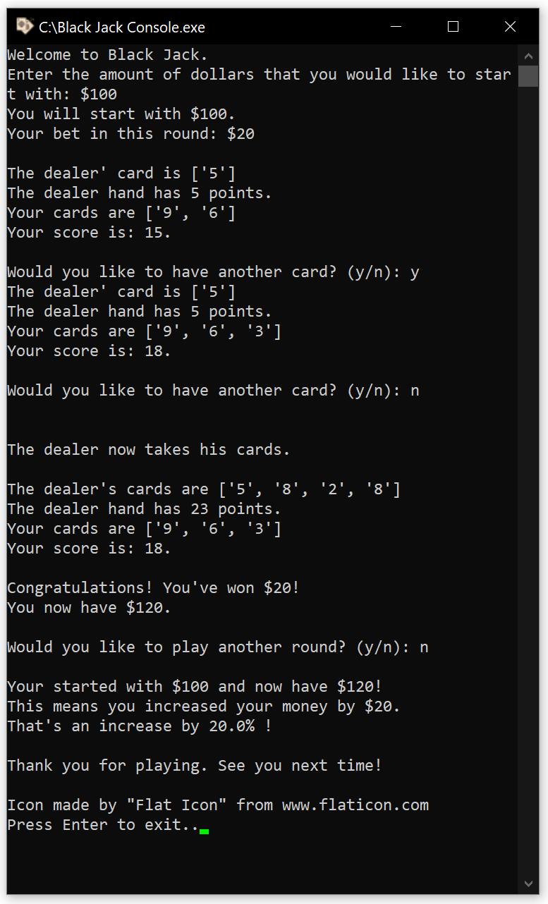

# BlackJackCommandLine
A command line application for the card game Black Jack.
It simply shows the player's and dealers cards as a list as well as their current points.
The starting capital can be chosen as well, but they'll only be stored during a game.
I'll might add an option to save the current bank balance in the future.

### Screenshots
The screenshot below shows an example for a Black Jack game with the code in this repository.
